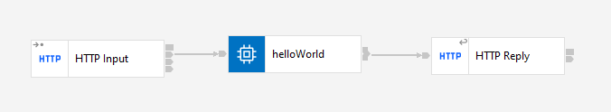
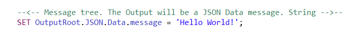

# Description

`Hello World` application is a demonstration of the possibilities of working on the IBM ACE bus version 12.0.5. It does not execute business functionality. 

The application returns "Hello World" string to the client in .json format and provides the following endpoint:

**`/acehelloworld/v1:`**

Using a *GET* method, it sends a request to the serwer and receives the mentioned string in response. 

# Implementation

**`helloWorld`**

The `HTTP Input node receives the request`. The `helloWorld` compute node creates the message tree and message body:

 Finally, `HTTP Reply` node sends the message to the client.

 # Format

 The app uses .json 